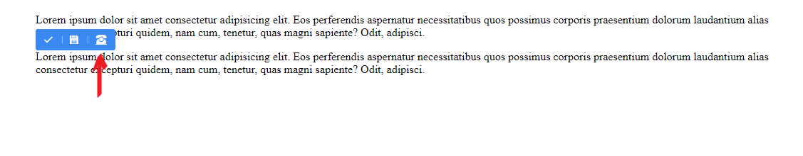

# How to use

- Create JS constant for app root address path ``` const urlroot = "http://something.com" ``` inside head tag
- In head tag import **tinyeditor.js** file
- In the end of the body tag initialize **'tinyeditor'**


```
FgTinyEditor.init({
    rootPath: 'http://tinyeditor.localhost',
    saveUrl: 'http://tinyeditor.localhost',
    loadjQuery: true,
    tools: [
        {
            icon: '&#9742;',
            title: 'Paint this',
            callback: () => {
                alert('Custom button with alert callback');
            }
        }
    ],
    onsave: res => console.log(res),
});
```

# Adding cunsomt icons / tools and functions

Inside options object add **tools** key with value of array.
Array consists from object of tools. Each object consists from tool icon, tool title and the callback.

Icon of the tool is HTML. It can be SVG, html unicode icon, or font icon.



```
FgTinyEditor.init({
    tools: [
        {
            icon: '&#9742;',
            title: 'Paint this',
            callback: () => {
                alert('Custom button with alert callback');
            }
        }
    ]
})
```

# Make content editable

In HTML parent element must have class of **editable** and child element must have class of **editable-cage**. See example

```
<section>
    <div class="container">

        <div class="editable">
            <div class="editable-cage">
                <h1>This is sample heading</h1>
                <p>This is sample contnet</p>
            </div>
        </div>

    </div>
</section>
```

# elFinder file manager

Filemanager can be used from tinymce as well as with independent function ```filemanager(callback)```

Doubleclicking on the file inside the filemanager returns callback with file path. When using tinymce, it adds file path in tinymce url input.


## Open filemanager modal
```
filemanager(files => {
    console.log(files);
});
```


# Save callback

Save callback response delivers content wrapper **editable-cage** along with **alias**.

## Alias 

Alias is an attribute of **.editable** class element. Alias attribte designed for adding custom information about where you want to save your contnet (table/row name so on...)

```
<section>
    <div class="container">

        <div class="editable" alias="pages.url.content">
            <div class="editable-cage">
                <h1>This is sample heading</h1>
                <p>This is sample contnet</p>
            </div>
        </div>

    </div>
</section>
```