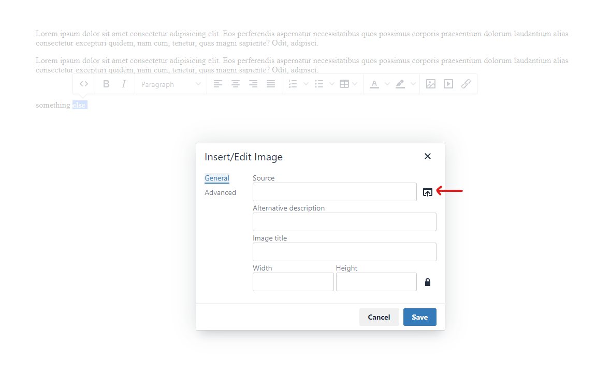

# How to use

- In head tag import **tinyeditor.js** file
- In the end of the body tag initialize **'tinyeditor'**


```
FgTinyEditor.init({
    rootPath: 'http://tinyeditor.localhost',
    saveUrl: 'http://tinyeditor.localhost',
    loadjQuery: true,
    tools: [
        {
            icon: '&#9742;',
            title: 'Paint this',
            callback: () => {
                alert('Custom button with alert callback');
            }
        }
    ],
    onsave: res => console.log(res),
});
```

# Adding cunsomt icons / tools and functions

Inside options object add **tools** key with value of array.
Array consists from object of tools. Each object consists from tool icon, tool title and the callback.

Icon of the tool is HTML. It can be SVG, html unicode icon, or font icon.


```
FgTinyEditor.init({
    tools: [
        {
            icon: '&#9742;',
            title: 'Paint this',
            callback: () => {
                alert('Custom button with alert callback');
            }
        }
    ]
})
```

# Make content editable

In HTML parent element must have class of **editable** and child element must have class of **editable-cage**. See example

```
<section>
    <div class="container">

        <div class="editable">
            <div class="editable-cage">
                <h1>This is sample heading</h1>
                <p>This is sample contnet</p>
            </div>
        </div>

    </div>
</section>
```

# elFinder file manager

Filemanager can be used from tinymce as well as with independent function ```filemanager(callback)```

Doubleclicking on the file inside the filemanager returns callback with file path. When using tinymce, it adds file path in tinymce url input.



## Open filemanager modal
```
filemanager(files => {
    console.log(files);
});
```

# Contenet type
In some cases you might want to save content as json. In such situations you can simply add ```<div editable-type="json" class="editable"></div>``` attribute in the parent element, where class="editable" is declared.

After adding attribute you must add ```editable-json="key"``` and ```editable-json="value"``` attributes in the child elements in order to determine which content is key for the json and which - value.

**Note that keys must differ!**

**Take a look at the example below.**

```
<div class="editable" alias="posts.21.body" editable-type="json">
    <ul class="editable-cage">
        <li editable-json="key">OS</li>
        <li editable-json="value">Windows 10</li>
        <li editable-json="key">CPU</li>
        <li editable-json="value">AMD Rysin 3</li>
    </ul>
</div>

```


# Save callback

Save callback response delivers content wrapper **editable-cage** along with **alias**.

## Alias 

Alias is an attribute of **.editable** class element. Alias attribte designed for adding custom information about where you want to save your contnet (table/row name so on...)

```
<section>
    <div class="container">

        <div class="editable" alias="pages.url.content">
            <div class="editable-cage">
                <h1>This is sample heading</h1>
                <p>This is sample contnet</p>
            </div>
        </div>

    </div>
</section>
```

# Save content
There are several rules to folow and also several things to note.

1. Once you click the save button, putch request is triggered.
2. The save url can be provided inside the **FgTinyEditor.init** method.
3. Received data inside the server is the object of alias and content
4. For this example, table name, record id and row name must be added inside the alias and must be separated with the comma.

```
<div class="editable" alias="posts.1.content">
    <div class="editable-cage">
        <h1>This is the sample content</h1>
        <p>This is the sample content body</p>
    </div>
<div>
```

## Save function in PHP
This is codeigniter 4 method with RedBeanPHP SQL driver

```
// Quick update
public function quickupdate(string $url) {

    // Get sent content
    $fetchedData    = json_decode($this->request->getBody());
    $content        = $fetchedData->content;
    $alias          = $fetchedData->alias ?? '';
    $page           = null;

    // Get table
    $aliasArr       = explode('.', $alias);
    $table          = $aliasArr[0]; // Table name
    $id             = $aliasArr[1]; // Table determinant 
    $row            = $aliasArr[2]; // Row where content is going to be changed

    // Find page to be updated
    $page = R::findOne($table, 'id = ?', [$id]);

    // Check if page exist
    if ($page) {
            
        ///////////// Save base64 image as file /////////////
        // Check if image inside the content
        preg_match_all('/src="data:image(.*)"/', $content, $matches);
        
        // Generate image name with save location
        $imageSavePath = dirname(APPPATH).'/public/tinyeditor/filemanager/files/';
        
        if (!empty($matches[1])) {
            // Convert base63 to image and save to the provided location with random name
            $savedImagesArray = base64_to_jpeg($matches[1], $imageSavePath);
                            
            // Replace base64 images to real images
            foreach ($savedImagesArray as $src) 
                $content = preg_replace('#((?!src=)[^>])*?src=")data:image/(gif|png|jpeg);base64,([\w=+/]++)("[^>]*>)#', "", $content);
        }

        // Prepare image src's to save, create absolute path placeholder '%RELEVANT_PATH%'
        $content = relevantpath($content, false);
        ///////////// Save base64 image as file - END /////////////
        
        // Update DB
        $page->{$row} = $content; // Conver JSON string back to php Object
        R::store($page);

        return $this->response->setJSON(["success" => "Content has been updated successfully"]);
    } else {

        return $this->response->setJSON(["error" => "Error while saving. Page source not found!"]);
    }
}
```

