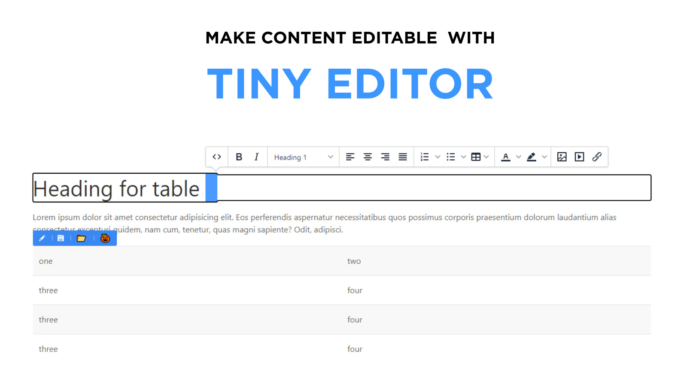

# How to use
This is a really easy to use tool, ready to make page content editable with build in tinyMCE editor and elFinder file manager.



**Requires only one file to include!**

- In head tag import **tinyeditor.js** file
- In the end of the body tag initialize **'tinyeditor'**


```
new FgTinyEditor({
    selector: '.editable',
    rootPath: '<?= base_url('tinyeditor') ?>',
    saveUrl: '<?= base_url('save') ?>',
    defaultTools: true, // Default is true
    loadjQuery: true,
    tools: [{
        icon: '📂',
        title: 'Paint this',
        callback: () => filemanager(() => {})
    }, {
        icon: '🎃',
        title: 'Paint this',
        callback: () => alert('Custom button with alert callback')
    }],
    onActive: e => console.log('Active'),
    onDisabled: e => console.log('Disabled'),
    onClick: e => console.log('clicked'),
    onResponse: res => console.log(res),
    //onSave: data => console.log(data), // Optional
    tinymceConfig: {}
});
```

# Remove tags from content

In cases when is unnecessary to save clean text, without html tags, add **wipe-tags** attribute to parent editable element. 
```
<div class="editable" wipe-tags="true">
    <div class="editable-cage">
        <p>Lorem ipsum dolor sit amet consectetur adipisicing elit.</p>
    </div>
</div>
```

# Remove default tools

If you want to remove default tools from all editable areas, you must add **defaultTools: false** inside options.

```
new FgTinyEditor({
    defaultTools: true, // Default is true
});
```

In order to disable default tools only in one editable area, you must provide attribute **default-tools="false"**

```
<div class="editable" default-tools="false">
    <div class="editable-cage">
        <p>Lorem ipsum dolor sit amet consectetur adipisicing elit.</p>
    </div>
</div>
```


# Additional tools

## Insert from object
```
new FgTinyEditor({
    tools: [{
        icon: '📂',
        title: 'Paint this',
        callback: () => filemanager(() => {})
    }, {
        icon: '🎃',
        title: 'Paint this',
        callback: () => alert('Custom button with alert callback')
    }],
})
```

## Insert individual tools inline
```
<div class="editable" tools="[icon: 🎃; title: Something; callback: something;][icon: 🦘; title: New title; callback: something;]">
    <div class="editable-cage">
        <p quas magni sapiente? Odit, adipisci.</p>
    </div>
</div>
```
When inserting individual tools, callback must be declared inside initialization object, inside **inlineFunctions** object
```
new FgTinyEditor({
    selector: '.editable',
    rootPath: 'http://localhost:8080/tinyeditor',
    saveUrl: 'http://localhost:8080',
    loadjQuery: true,
    inlineFunctions: {
        something: () => {
            alert('done');
        }
    }
});
```

# Adding cunsomt icons / tools and functions

Inside options object add **tools** key with value of array.
Array consists from object of tools. Each object consists from tool icon, tool title and the callback.

Icon of the tool is HTML. It can be SVG, html unicode icon, or font icon.


```
new FgTinyEditor({
    tools: [
        {
            icon: '&#9742;',
            title: 'Paint this',
            callback: () => {
                alert('Custom button with alert callback');
            }
        }
    ]
})
```

# Make content editable

In HTML, parent element must have class that you specified in selector of the initialization function, for instances - **editable** and child element must have the same class with '-cage' at the end: **editable-cage**. See example

```
<section>
    <div class="container">

        <div class="editable">
            <div class="editable-cage">
                <h1>This is sample heading</h1>
                <p>This is sample contnet</p>
            </div>
        </div>

    </div>
</section>
```

# Add parameters. Send parameters to the save method.

Sometimes you want to send some custom parameters to the save method. There are two options for that.
1. Add parameters object to the initialization function.

```
new FgTinyEditor({
    params: {type: 'profile', mode: 'direct'},
})
```

2. Add params attribute inline, directly to the element. Note that params must be the type of JSON.

*Note that **params** attribute rewrites **params** object added to the initialization function.*

```
<div class="editable" params='{"one": "This is one", "two": "This is two"}'>
    <div class="editable-cage">...</div>
</div>
```

# elFinder file manager

Filemanager can be used from tinymce as well as with independent function ```filemanager(callback)```

Doubleclicking on the file inside the filemanager returns callback with file path. When using tinymce, it adds file path in tinymce url input.


## Open filemanager modal
```
filemanager(files => {
    console.log(files);
});
```

# Contenet type
In some cases you might want to save content as json. In such situations you can simply add ```<div editable-type="json" class="editable"></div>``` attribute in the parent element, where class="editable" is declared.

After adding attribute you must add ```editable-json="key"``` and ```editable-json="value"``` attributes in the child elements in order to determine which content is key for the json and which - value.

**Note that keys must differ!**

**Take a look at the example below.**

```
<div class="editable" alias="posts.21.body" editable-type="json">
    <ul class="editable-cage">
        <li editable-json="key1">OS</li>
        <li editable-json="value1">Windows 10</li>
        <li editable-json="key2">CPU</li>
        <li editable-json="value2">AMD Rysin 3</li>
    </ul>
</div>

```


# onResponse

**onResponse** callback delivers content wrapped in **editable-cage** along with **alias**.

## Alias 

Alias is an attribute of **.editable** class element. Alias attribte designed for adding custom information about where you want to save your contnet (table/row name so on...)

```
<section>
    <div class="container">

        <div class="editable" alias="pages.url.content">
            <div class="editable-cage">
                <h1>This is sample heading</h1>
                <p>This is sample contnet</p>
            </div>
        </div>

    </div>
</section>
```

# Save content

There are two method with you can update content.

First - is **onSave(dataObject)** callback that you can use inside the init function.

Second - if onSave() method is not specified, plugin automatically send patch request to the server on the url declared in the initialization function, in **saveUrl**.

***

There are several rules to folow and also several things to note.

1. Once you click the save button, putch request is triggered.
2. The save url can be provided inside the **FgTinyEditor.init** method.
3. Received data inside the server is the object of alias and content
4. For this example, table name, record id and row name must be added inside the alias and must be separated with the comma.

```
<div class="editable" alias="posts.1.content">
    <div class="editable-cage">
        <h1>This is the sample content</h1>
        <p>This is the sample content body</p>
    </div>
<div>
```

## Save instructions for Codeigntier 4
This is **codeigniter 4** method with PagesModel and two custom helper methods for working with base64 images and generate relevant path for them.

1. Connect to your database
2. Go to the App/Config/routes.php and add route to content update

```
$routes->patch('save', 'Save::quickupdate')
```
3. Go to command line and make new controller with following command - 
```
    php spark make:controller save
```
4. Go to command line and make new migration
```
php spark make:migration pages
```
5. Inside the page migration file located in - *App/Database/Migrations*, paste following code.
```
    <?php

namespace App\Database\Migrations;

use CodeIgniter\Database\Migration;

class Pages extends Migration
{
	public function up()
	{
		$this->forge->addField([
			'id' => [
				'type' => 'INT',
				'constraint' => 5,
				'unsigned' => true,
				'auto_increment' => true
			],
			'title' => [
				'type' => 'VARCHAR',
				'constraint' => 255
			],
			'content' => [
				'type' => 'TEXT',
				'null' => true
			]
		]);

		$this->forge->addKey('id', true);
		$this->forge->createTable('pages');
	}

	public function down()
	{
		$this->forge->dropTable('pages');
	}
}
```
6. Create model from command line
```
php spark make:model pages_model --return object
```
7. Go to the *App/Models/PagesModel.php* and inside the $allowedFields array add *title* and *content* fields
```
protected $allowedFields = [
    'title', 'content'
];
```

Don't forget to add proper alias to the HTML element your want to save to the database

```
<div class="editable" alias="pages.1.content">
    <div class="editable-cage">
        <h1>About this page</h1>
    </div>
</div>
```

8. Initialize tinyeditor for following...
```
new FgTinyEditor({
    selector: '.editable',
    rootPath: '<?= base_url('tinyeditor') ?>',
    saveUrl: '<?= base_url('save') ?>',
    loadjQuery: true,
});

```

9. Now go to the Save.php controller - *App/Controllers/Save.php* and paste following methods.

First method going to handle save functionality. Other - second and third method are helper methods for working with base64 images and their paths.


```
// Quick update
public function quickupdate() {

    $pagesModel = new \App\Models\PagesModel();

    // Get sent content
    $fetchedData    = json_decode($this->request->getBody());
    $content        = $fetchedData->content;
    $alias          = $fetchedData->alias ?? '';
    $page           = null;

    // Get table
    $aliasArr       = explode('.', $alias);
    $table          = $aliasArr[0]; // Table name
    $id             = $aliasArr[1]; // Table determinant 
    $row            = $aliasArr[2]; // Row where content is going to be changed

    // Find page to be updated
    $page = $pagesModel->where('id', $id)->first();

    // Check if page exist
    if ($page) {
            
        ///////////// Save base64 image as file /////////////
        // Check if image inside the content
        preg_match_all('/src="data:image(.*)"/', $content, $matches);
        
        // Generate image name with save location
        $imageSavePath = dirname(APPPATH).'/public/tinyeditor/filemanager/files/';
        
        if (!empty($matches[1])) {
            // Convert base63 to image and save to the provided location with random name
            $savedImagesArray = $this->base64_to_jpeg($matches[1], $imageSavePath);
                            
            // Replace base64 images to real images
            foreach ($savedImagesArray as $src) 
                $content = preg_replace('#((?!src=)[^>])*?src=")data:image/(gif|png|jpeg);base64,([\w=+/]++)("[^>]*>)#', "", $content);
        }

        // Prepare image src's to save, create absolute path placeholder '%RELEVANT_PATH%'
        $content = $this->relevantpath($content, false);
        ///////////// Save base64 image as file - END /////////////
        
        // Update DB
        $pagesModel->update($id, [
            $row => $content
        ]);

        return $this->response->setJSON(["success" => "Content has been updated successfully"]);
    } else {

        return $this->response->setJSON(["error" => "Error while saving. Page source not found!"]);
    }
}


private function relevantpath($content, $prepare = true) {

    // If TRUE - replace to relevant URL (site URL)
    if ($prepare) {

        $content = str_replace('%RELEVANT_PATH%', base_url('tinyeditor/filemanager'), $content);
        return $content;
    } else {
        // If FALSE - replace to %RELEVANT_PATH%
        
        // Find images
        $srcReplaced = [];
        // preg_match_all("/src=[\"']([^http|$\/\/].*)[\"']/", $content, $matches);
        preg_match_all("/src=\"(.*)\"/", $content, $matches);

        foreach ($matches[1] as $key => $src) {
            if (strpos($src, 'filemanager')) {
                $srcArr = explode('filemanager', $src)[1];
                $srcReplaced[] = '%RELEVANT_PATH%'.$srcArr;
            }
        }

        // Change image urls
        foreach ($srcReplaced as $key => $src) {
            $content = str_replace($matches[1][$key], $src, $content);
        }

        return $content;
    }
    
}


private function base64_to_jpeg($base64_string, $output_file) {
        
    // Check file format
    $exts = ['jpg', 'jpeg', 'png', 'gif', 'tiff', 'webm'];
    
    // Images array
    $imagesArray = [];
    
    foreach ($base64_string as $base) {
        
        // Find extention in base64
        preg_match('/(?:[A-z]+)/', $base, $extension);
        $ext = !empty($extension) ? $extension[0] : null;

        // Check if not null
        if (!$ext) return false;

        // Check if extension name is valid
        if (!in_array($ext, $exts)) return false;    
        
        $imageName = $output_file . 'image-' . rand() . time() . '.' . $ext;
        $imagesArray[] = $imageName;

        // open the output file for writing
        $ifp = fopen($imageName, 'wb');

        $data = explode(',', $base);

        // we could add validation here with ensuring count( $data ) > 1
        fwrite( $ifp, base64_decode($data[ 1 ]) );

        // clean up the file resource
        fclose($ifp); 
    }  
    
    return $imagesArray;
}

```

